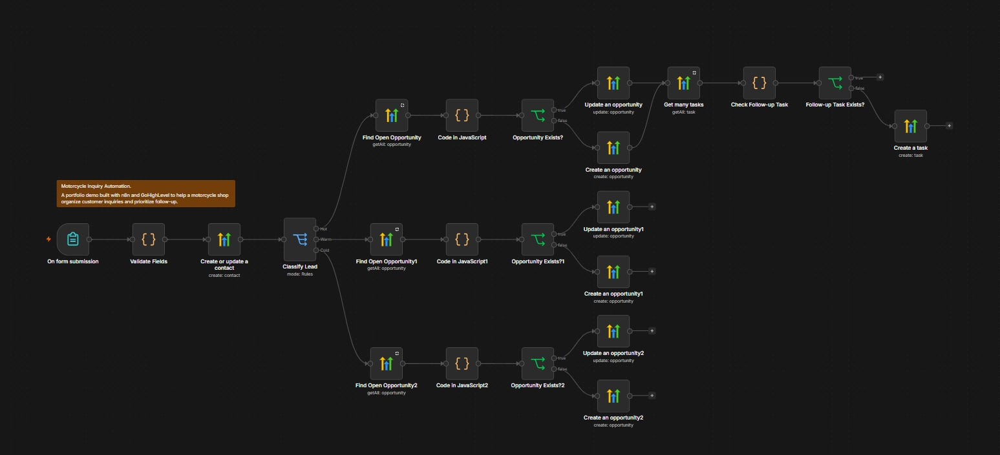

# Automated Customer Inquiry & Lead Tracking System

A portfolio demo built with **n8n** and **GoHighLevel** to help a motorcycle shop organize customer inquiries and prioritize follow-up.

## Features

- Collect customer inquiries through an n8n form.
- Validate required fields, email format, budget, and purchase timeline.
- Create or update CRM contacts by email.
- Route leads to sales pipeline stages using purchase-timeline rules.
- Update an existing open opportunity for the same contact in the selected pipeline instead of creating another.
- Create a follow-up task for Hot leads when no unfinished task with the matching title exists.

The first version uses rules and does not require AI.

## Lead classification

| Purchase timeline | Lead | Pipeline stage |
| --- | --- | --- |
| Within 7 days | Hot | Priority Follow-up |
| Within 30 days | Warm | Interested |
| Just browsing | Cold | New Inquiry |

## Workflow

Form submission → Validate Fields → Create or update a contact → Classify Lead → Find Open Opportunity → Match contact → Create or update opportunity.

Hot leads continue through Get many tasks → Check Follow-up Task → Follow-up Task Exists? → Create a task only on False. True ends the branch.

Warm and Cold branches end after opportunity creation or update. Task creation is implemented for Hot leads only.



## Files

- `motorcycle-inquiry-workflow.json`: sanitized n8n workflow template.
- `README.md`: project overview and setup instructions.

## Setup

1. Import `motorcycle-inquiry-workflow.json` into a new n8n workflow.
2. Configure your own HighLevel OAuth2 credential and select it in every HighLevel node. See the [n8n HighLevel credential documentation](https://docs.n8n.io/integrations/builtin/credentials/highlevel/).
3. In your GoHighLevel sub-account, create a pipeline named `Motorcycle Inquiries` with these stages: New Inquiry, Interested, Priority Follow-up, Closed Won, and Closed Lost.
4. Configure the pipeline and stage fields using the table below. Replace each placeholder with an ID from your own account.
5. Keep **Return All** and **Always Output Data** enabled on all three Find Open Opportunity nodes and on Get many tasks.
6. Test using the Form Trigger's test URL. The workflow is exported inactive; publish or activate only after configuring and testing your own copy.

### Account-specific configuration

| Exact node names | Field | Placeholder |
| --- | --- | --- |
| Find Open Opportunity; Find Open Opportunity1; Find Open Opportunity2 | Filters → Pipeline Name or ID | `REPLACE_WITH_PIPELINE_ID` |
| Create an opportunity; Create an opportunity1; Create an opportunity2 | Pipeline Name or ID | `REPLACE_WITH_PIPELINE_ID` |
| Create an opportunity; Update an opportunity | Stage Name or ID | `REPLACE_WITH_PRIORITY_FOLLOW_UP_STAGE_ID` |
| Create an opportunity1; Update an opportunity1 | Stage Name or ID | `REPLACE_WITH_INTERESTED_STAGE_ID` |
| Create an opportunity2; Update an opportunity2 | Stage Name or ID | `REPLACE_WITH_NEW_INQUIRY_STAGE_ID` |

In Create nodes, select your pipeline and stage from the dropdowns. In Update nodes, keep Stage Name or ID in Expression mode and replace the placeholder inside the quoted string with your stage ID.

For example, the Hot Update node uses:

```javascript
{{ 'YOUR_PRIORITY_FOLLOW_UP_STAGE_ID' }}
```

Contact IDs and opportunity IDs are taken from the workflow at runtime. Do not replace those expressions with fixed customer IDs.

### Sample form data

Use synthetic data for demos:

| Field | Example |
| --- | --- |
| Name | Demo Buyer |
| Email | buyer@example.com |
| Motorcycle of interest | Yamaha NMAX |
| Budget | 87000 |
| Purchase timeline | Within 7 days |
| Message | Is this unit available? |

## Verification

Observed in the configured demo: Hot, Warm, and Cold opportunity creation; Hot and Cold opportunity updates; a Cold-to-Hot transition; follow-up task creation; and a corrected Hot repeat-submission run that skipped task creation.

Repeat these checks after configuring your own copy:

- Submit a new inquiry for each of the three timelines and confirm the stage.
- Submit the same email again and confirm the existing open opportunity is updated.
- Change a customer's timeline from Just browsing to Within 7 days and confirm the existing opportunity moves to Priority Follow-up.
- Repeat a Hot inquiry with an unfinished matching follow-up task and confirm the task check takes True without creating another task.
- Submit invalid or missing values and confirm validation stops processing before the CRM.

Static checks on this public export verified JSON validity, unchanged Code-node logic, corrected task-check wiring, and removal of source account identifiers. The sanitized template needs account configuration before it can run.

## Current limitations

- The Hot Create Opportunity node does not yet set Monetary Value; Hot updates and Warm/Cold creation or updates do. To complete that field, add Monetary Value as `{{ $json.budget }}` in `Create an opportunity`.
- Update Opportunity nodes change the value and stage, but do not yet refresh the opportunity name when the motorcycle changes.
- Duplicate checks apply to sequential submissions; they are not an atomic guarantee against simultaneous submissions.
- Tasks are created for Hot leads only. An existing unfinished task is reused without updating its body or due date.
- This is a tested portfolio demo, not a claim of a live client deployment.

## Public-export sanitation

The JSON removes credential references, workflow/version/instance metadata, tags, and pinned data. Original node and webhook IDs are regenerated. GoHighLevel pipeline and stage IDs are replaced with documented placeholders. The corrected connections and existing business logic are retained.

When adding screenshots or a demo video, use synthetic contacts and conceal account-specific identifiers. Upload this sanitized template rather than your account-bound n8n export.
